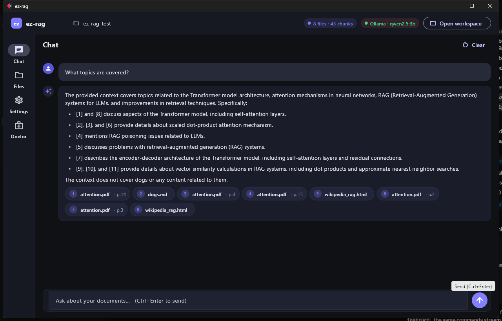
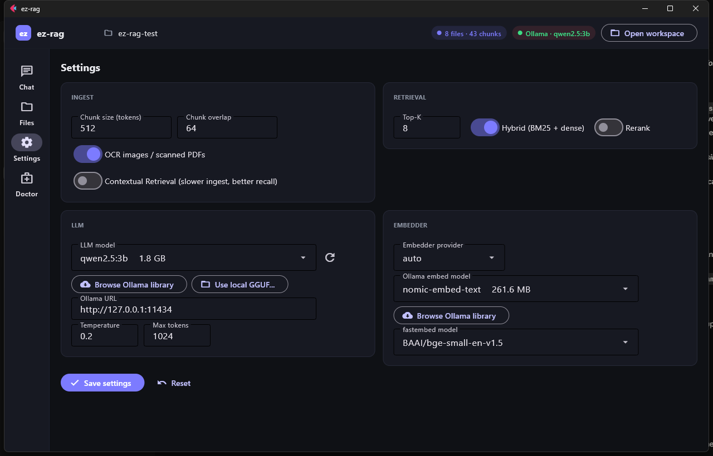
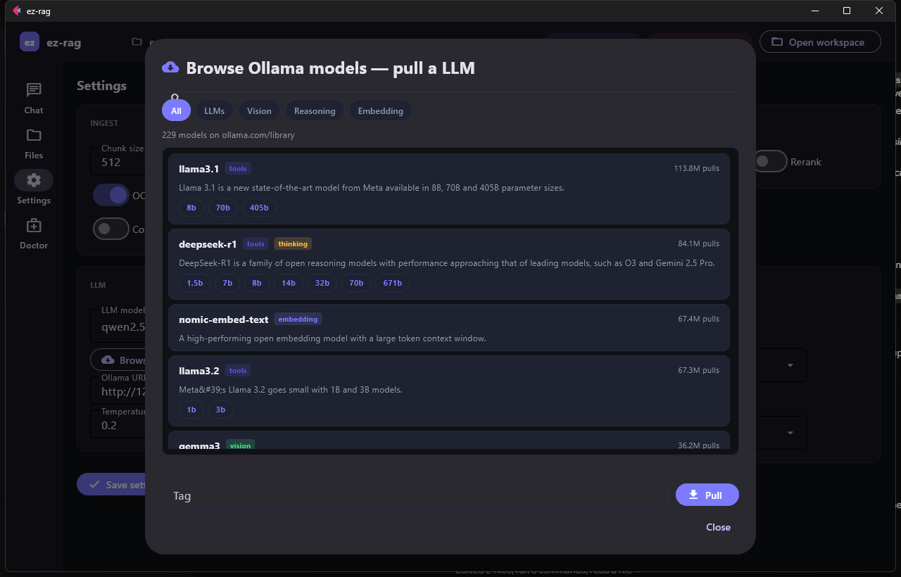

# ez-rag

> **🧪 Status: experimental / alpha.** Working end-to-end on Windows / macOS / Linux,
> verified by [a benchmark suite](benchmark/) that runs every release. APIs,
> file layouts, and config keys may change without notice. See
> [docs/STATUS.md](docs/STATUS.md) for what's solid vs. what's flaky.

Drop documents in a folder, chat with them. Local, offline, free.



```
docs/  ─►  parse + chunk  ─►  embed  ─►  vector index (SQLite)
                                              │
                                              ▼
question  ─►  hybrid search ─►  rerank  ─►  LLM (Ollama or llama.cpp)  ─►  answer + citations
```

## Install

```bash
# 1) ez-rag itself, with OCR + GUI extras
pipx install "ez-rag[ocr,gui]"
# or:
pip install --user "ez-rag[ocr,gui]"

# 2) (recommended) Ollama for the LLM and embeddings — https://ollama.com/download
ollama pull qwen2.5:7b-instruct
ollama pull nomic-embed-text
```

On Windows, double-click [`ez-rag-gui.bat`](ez-rag-gui.bat) from the repo. The first run installs missing deps automatically; subsequent runs go straight to the window.

If Ollama isn't installed, ez-rag still works for retrieval — it ships with a local CPU embedder (fastembed) and prints ranked passages instead of an LLM answer. Pull a model later and answers light up.

## Quickstart (60 seconds)

```bash
mkdir my-rag && cd my-rag
ez-rag init .
cp ~/Downloads/*.pdf docs/        # any PDFs, DOCX, XLSX, HTML, MD, TXT, screenshots…
ez-rag ingest
ez-rag ask "What does this corpus say about X?"
ez-rag chat                       # or interactive
```

## Supported file types

PDF (text + scanned with OCR fallback) · DOCX · XLSX · CSV · HTML · MD · TXT / RST / LOG · EPUB · EML · PNG / JPG / WEBP / TIFF / BMP (OCR'd).

## Terminology

The docs and the GUI use these three words deliberately — they're not interchangeable:

| Term | What it means | Where it lives |
|---|---|---|
| **Corpus** | Your collection of source documents (the input). From linguistics, Latin for "body." | `<workspace>/docs/` |
| **Index** | The searchable data structure ez-rag builds *from* the corpus: chunks + embeddings + BM25. | `<workspace>/.ezrag/meta.sqlite` |
| **RAG** | **R**etrieval-**A**ugmented **G**eneration — the whole technique. Corpus + index + retrieval + LLM glued together. | The workspace as a whole |

Litmus test: if `ez-rag ingest` can rebuild it, you changed the **index**. If your original files survive, the **corpus** is intact. If you only touched Settings or the model, the **corpus** and **index** are both unchanged — you changed the **RAG**'s configuration.

Other recurring vocabulary:

- **Embedder** / **embedding model** — small model that turns text into fixed-length vectors. Used at *both* ingest and query time. Swapping it forces a full re-ingest.
- **Embedding** / **vector** / **dense vector** — the numeric output of the embedder. Texts with similar meaning land near each other in vector space.
- **Reranker** / **cross-encoder** — second-stage scoring model that judges `(query, passage)` pairs jointly. Biggest single quality lift in most pipelines, ~10 ms / candidate.
- **Chunk** — a piece of a document the embedder sees (~512 tokens by default). The thing actually retrieved.
- **Hybrid retrieval** — fuses BM25 (keyword) and dense (vector) results via Reciprocal Rank Fusion.

## CLI

```
ez-rag init [PATH]            scaffold a workspace
ez-rag ingest [--watch]       parse, chunk, embed everything in ./docs/
ez-rag ask "question"         one-shot Q&A with citations  (--no-rag, --top-k N)
ez-rag chat                   interactive REPL with conversation memory
ez-rag status                 workspace stats
ez-rag models                 show LLM + embedder in use
ez-rag serve                  OpenAI-compatible HTTP endpoint on :11533
ez-rag doctor                 diagnose env (GPU, OCR, Ollama, deps)
ez-rag reindex                re-chunk/re-embed without re-parsing
ez-rag help <topic>           offline manual pages
```

Topics for `ez-rag help`: `getting-started`, `workflow`, `ingestion`, `retrieval`, `models`, `chat`, `gui`, `ocr`, `cli`.

## GUI

```bash
ez-rag-gui
```

Tabs:

- **Chat** — multi-turn conversation, streaming markdown, clickable citation chips. **Enter** sends, **Shift+Enter** newlines. Reasoning-model thoughts (deepseek-r1, etc.) render in a dedicated dim panel above the answer so the bubble is never silent.
- **Files** — drag-and-drop into `docs/`, ingest with live progress, see per-file chunk counts.
- **Settings** — chunk size, top-K, OCR, models, every retrieval option (rerank, HyDE, multi-query, MMR, neighbor windowing, contextual). Hover anything for a tooltip.
- **Doctor** — environment check.
- **? Help** and **ⓘ About** in the header — overlays render the offline manual.



### Browse the Ollama library

Settings → **Browse Ollama library** opens a searchable browser of every public model on `ollama.com/library` (≈230 models, cached for 6 h). Filter by capability (LLMs · Vision · Reasoning · Embedding), search by name, click a size chip to fill the Tag field, hit **Pull** to download with a streaming progress bar.



Each size chip shows an estimated VRAM number and color-codes against your GPU:

- 🟢 green — fits comfortably (≤ 85 % of total VRAM)
- 🟠 amber — tight (85 – 105 %)
- 🔴 red — won't fit
- gray — no NVIDIA GPU detected (estimate shown anyway)

### Local GGUF

Settings → **Use local GGUF…** opens a file picker. Pick a `.gguf` and ez-rag switches to the `llama-cpp` backend pointing at that file. Install the runtime once with `pip install llama-cpp-python`.

## Retrieval pipeline (smart defaults)

```
question → [HyDE]? → [multi-query]? → hybrid (BM25 + dense, RRF)
                                            ↓
                                  cross-encoder rerank → [MMR]? → top-K → [window]? → LLM
```

| Stage | On by default | Why / when |
|---|:---:|---|
| **Hybrid (BM25 + dense, RRF)** | ✅ | almost free; covers both keyword and semantic matches |
| **Cross-encoder rerank** | ✅ | the single biggest accuracy lift; ~50–200 ms |
| **HyDE** | ☐ | corpus and questions use different vocabularies |
| **Multi-query** | ☐ | one question can be phrased many ways |
| **MMR** | ☐ | retrieved chunks are redundant / near-duplicates |
| **Context window (±N neighbors)** | ☐ | narrative or long-form docs |
| **Contextual Retrieval** *(at ingest)* | ☐ | technical / structured docs (~49 % fewer retrieval failures, but slow ingest) |
| **Agentic mode** | ☐ | LLM iteratively reflects + re-searches when initial hits look weak. Uses your chat model by default; OpenAI / Anthropic / OpenAI-compat supported as upgrades |
| **Query modifiers** *(prefix · suffix · negatives)* | ☐ | persistent persona / formatting / "avoid X" wrappers around every question. Per-query checkbox in the chat composer |
| **Use RAG** | ✅ | toggle OFF in the Chat tab to A/B compare model-only vs RAG-augmented |

Defaults are tuned for "drop docs, get good answers." See `ez-rag help retrieval` or the GUI's Help (?) for the empirical config matrix and when to flip what.

## Quick model picks by VRAM

| GPU | LLM | Embedder |
|---|---|---|
| 24 GB+ | `qwen2.5:14b-instruct` or `gemma3:27b` or `deepseek-r1:32b` | `bge-m3` |
| 16 GB | `qwen2.5:7b-instruct` or `qwen3:8b` | `nomic-embed-text` |
| 8 GB | `qwen2.5:3b` or `phi4-mini` | `nomic-embed-text` |
| no GPU, 16 GB RAM | `phi4-mini` or `llama3.2:3b` | `nomic-embed-text` |
| no GPU, 8 GB RAM | retrieval-only mode | `BAAI/bge-small-en-v1.5` |

## Examples

See [docs/EXAMPLES.md](docs/EXAMPLES.md).

## Benchmark

Two harnesses, both reproducible:

```bash
python benchmark/run_benchmark.py            # public-document corpus, RAG end-to-end
python benchmark/rag_compare.py              # RAG-on / RAG-off comparison across models
python benchmark/bench_configs.py            # measure each retrieval option on/off
```

Reports land in `benchmark/reports/`.

## Architecture

See [PLAN.md](PLAN.md) for the module map. Short version:

- `parsers.py` — PDF / DOCX / XLSX / HTML / MD / EPUB / images
- `ocr.py` — RapidOCR primary, Tesseract fallback
- `chunker.py` — recursive split with token-target + overlap
- `embed.py` — Ollama embed if reachable, else fastembed; cross-encoder reranker
- `index.py` — SQLite + FTS5 + numpy cosine
- `retrieve.py` — hybrid BM25 + dense, RRF, optional rerank / MMR / HyDE / multi-query / neighbor expansion
- `generate.py` — Ollama → llama-cpp → retrieval-only; reasoning-model `thinking` field surfaced separately
- `models.py` — Ollama listing/pull, library scraper, VRAM estimator
- `server.py` — OpenAI-compatible `/v1/chat/completions`
- `gui/ez_rag_gui/main.py` — Flet desktop app

## Project status, in plain English

This started as a "drop docs, chat with them" experiment and grew into a working
local RAG system with a desktop GUI, model browser, VRAM estimator, retrieval
matrix, and a rerank pipeline. It works. It is not yet hardened.

Read [docs/STATUS.md](docs/STATUS.md) for the honest list of what works, what's
flaky, and what's not implemented yet.

## Acknowledgments

### Made by

[**Justin Rounds**](https://www.justinrounds.com) — designer, prompt engineer,
idea originator, and the human who is ultimately responsible for whatever this
turned into.

### Co-written with

A revolving cast of large language models. They wrote a lot of the code, took
none of the blame for the bugs, and at no point asked for breaks. We won't
name them — they know who they are.

### Standing on the shoulders of

- **Ollama** and **llama.cpp** — for making local inference look easy
- **Flet** — desktop GUI in plain Python, no Electron in sight
- **fastembed** + **RapidOCR** — embeddings and OCR that don't pull in 4 GB of
  PyTorch
- **pypdf**, **python-docx**, **openpyxl**, **beautifulsoup4** — the patient
  middle layer of the data world
- **SQLite + FTS5 + numpy** — still the right answer ten years later
- **Anthropic** — for the contextual-retrieval idea even though we ship without
  their model

### Special thanks to

- Every LLM that has helped someone debug a regex at 2 a.m.
- The maintainers of unglamorous middle-layer libraries
- Coke Zero, mostly
- That screenshot you accidentally pasted instead of the URL — it turned out to
  be exactly what was needed
- You, for reading this far

## License

Apache-2.0. See [LICENSE](LICENSE). Use it, fork it, name your goldfish after it.
